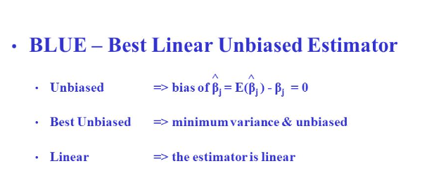

## Introduction to Quantitative Methods 

This work, as a whole, is licensed under a <a href="https://creativecommons.org/licenses/by-nc-nd/4.0/?ref=chooser-v1" target="_blank" rel="license noopener noreferrer" style="display:inline-block;"> Creative Commons Attribution-NonCommercial-NoDerivatives 4.0 International License </a>

### Georgia State University
### by [Ozlem Tuncel, PhD](https://ozlemtuncel.github.io/)

## Slides
- **[Introduction to Quantitative Analysis](https://docs.google.com/presentation/d/1qmCU4oig1vS0DXPxTBSNr2Jz1pQneqWCnY4L8EZlCXE/edit?usp=drive_link)** by Ozlem Tuncel
- **[Introduction to Descriptive and Advanced Statistics](https://docs.google.com/presentation/d/12OjPBTab5sZq4_3wNbdO2019eV644BVkMyT5FFvFolE/edit?usp=drive_link)** by Ozlem Tuncel

## Content and Resources

### Scientific Method
- 📖 [Scientific method](https://plato.stanford.edu/entries/scientific-method/) by Standford Encylopedia
- 📖 [Steps of scientific method](http://teacher.pas.rochester.edu/phy_labs/appendixe/appendixe.html)

### Research Design
- 🌐 [Types of research design](https://library.sacredheart.edu/c.php?g=29803&p=185902) by Sacred Heart University
- 🌐 [Organizing your social science research paper](https://libguides.usc.edu/writingguide/researchdesigns) by USC Library
- 🌐 [Qualitative vs quantiative research design](https://stevenson.libguides.com/c.php?g=236343)

### Research Question
- 🌐 [Characteristics of a good research question](https://libguides.umn.edu/c.php?g=1337354&p=9854773#:~:text=A%20good%20or%20well%2Dconstructed,that%20it%20can%20be%20answered.) by University of Minnesota
- 📖 [Research Questions](https://www.sjsu.edu/writingcenter/docs/handouts/Research%20Questions.pdf) by San Jose State University Writing Center

### Hypothesis and Theory
- 📖 [From theory to hypothesis](https://digitaleditions.library.dal.ca/researchmethodspsychneuro/chapter/chapter-3-from-theory-to-hypothesis/)
- 🌐 [Theoretical Framework of a Paper](https://libguides.usc.edu/writingguide/theoreticalframework) by USC Library

### Variables and Variable Types
- 📖 [Types of variables](https://www150.statcan.gc.ca/n1/edu/power-pouvoir/ch8/5214817-eng.htm)
- 🌐 [Variables types](https://www.codecademy.com/learn/stats-variable-types/modules/stats-variable-types/cheatsheet) with Python code
- 🌐 [Variable types](https://www.statisticshowto.com/probability-and-statistics/types-of-variables/) -- make sure to click on variable types to see examples.

### Research Ethics
- 📖 [Guiding principles for ethical research](https://www.nih.gov/health-information/nih-clinical-research-trials-you/guiding-principles-ethical-research) by NIH
- 🌐 [5 principles of research ethics](https://apa.org/monitor/jan03/principles) by APA

Make sure to check IRB (or equivalent ethics committee) website in your institution:
- 🌐 [GSU IRB](https://ursa.research.gsu.edu/human-subjects/)

### Graphical Methods
- 🌐 I have another course specifically designed to teach data viz with R: [https://ozlemtuncel.github.io/r_visualization/](https://ozlemtuncel.github.io/r_visualization/)
- 🌐 [Data visualization techniques](https://www.datacamp.com/blog/data-visualization-techniques) by DataCamp
- 🌐 [How to chose charts](https://www.atlassian.com/data/charts/how-to-choose-data-visualization)
- 🌐 [Data viz catalogue](https://datavizcatalogue.com/)
- 🌐 [17 data viz techniques to know](https://online.hbs.edu/blog/post/data-visualization-techniques) by Harvard Business School
- 🌐 [Descriptive stats in R](https://statsandr.com/blog/descriptive-statistics-in-r/)
- 📖 [Exploratory Data Analysis](https://r4ds.had.co.nz/exploratory-data-analysis.html) chapter from R for Data Science
- 🌐 [More on EDA](https://cran.r-project.org/web/packages/dlookr/vignettes/EDA.html)
  
### Measures of Central Tendency & Dispersion
- 📖 [Measures of Central Tendency and Dispersion](https://people.ohio.edu/ruhil/statsbook/meansd.html) 
- 📖 [Mean, median, mode, range](https://statistics.laerd.com/statistical-guides/measures-central-tendency-mean-mode-median.php)
- 🌐 [Measures of Central Tendency](https://online.stat.psu.edu/stat200/lesson/2/2.2/2.2.4) by Penn State

### Correlation
- 🌐 [Pearson, Kendall, and Spearman correlation](https://people.ohio.edu/ruhil/statsbook/meansd.html)
- 🌐 [Calculating Pearson, Kendall, and Spearman with Python](https://www.turintech.ai/four-methods-to-statistically-measure-your-data-correlation/)
- 🌐 [Correlation coefficients and interpretation](https://www.ncl.ac.uk/webtemplate/ask-assets/external/maths-resources/statistics/regression-and-correlation/strength-of-correlation.html)
- 📖 [From correlation to regression](https://www.bmj.com/about-bmj/resources-readers/publications/statistics-square-one/11-correlation-and-regression)

### Null Hypothesis Significance Testing (NHST) with Ordinary Least Squares (OLS)

- 🌐 [Visual Introduction to Linear Regression](https://mlu-explain.github.io/linear-regression/)
- 📖 ⭐ [Regression and Other Stories](https://avehtari.github.io/ROS-Examples/) -- one of the best books to read about regression
- 🌐 [Short intro to linear regression](http://www.stat.yale.edu/Courses/1997-98/101/linreg.htm)
- 📑 Make sure to read: Gill, Jeff. (1999). The insignificance of null hypothesis significance testing. *Political Research Quarterly*, 52(3), 647-674.
- 🌐 [OLS with R](https://www.css.cornell.edu/faculty/dgr2/_static/files/R_html/explainRegression.html)

### Assumptions of OLS
- 🌐 [Checking assumptions of OLS with R](https://www.rpubs.com/elliottb90/olsassumptions)
- 🌐 [Simplified OLS assumptions](https://www.albert.io/blog/key-assumptions-of-ols-econometrics-review/)
- 🌐 [OLS assumptions with visuals](https://bookdown.org/ripberjt/qrmbook/ols-assumptions-and-simple-regression-diagnostics.html)
